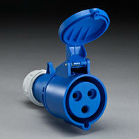
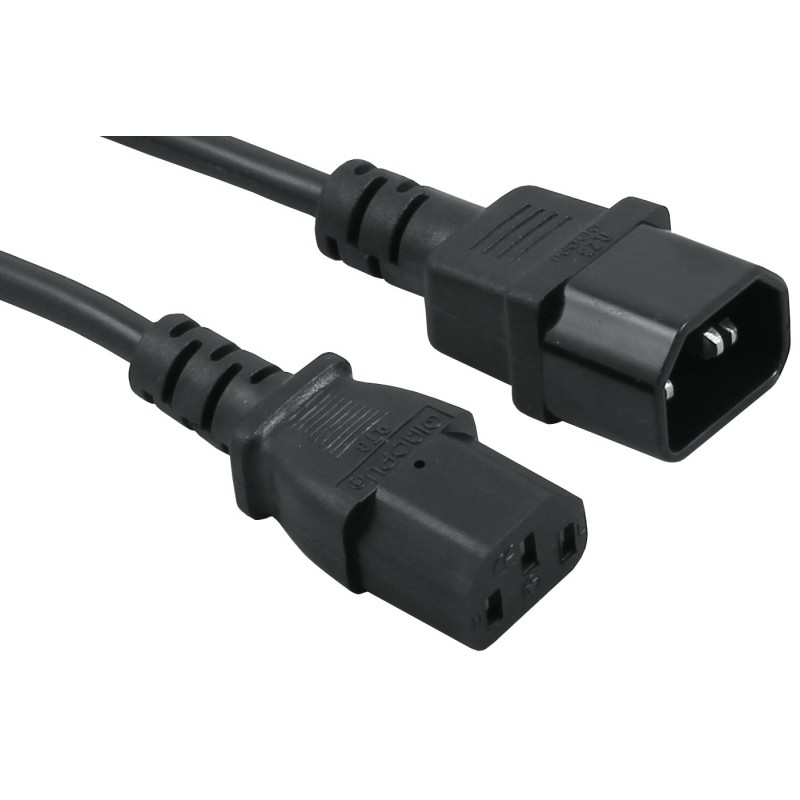
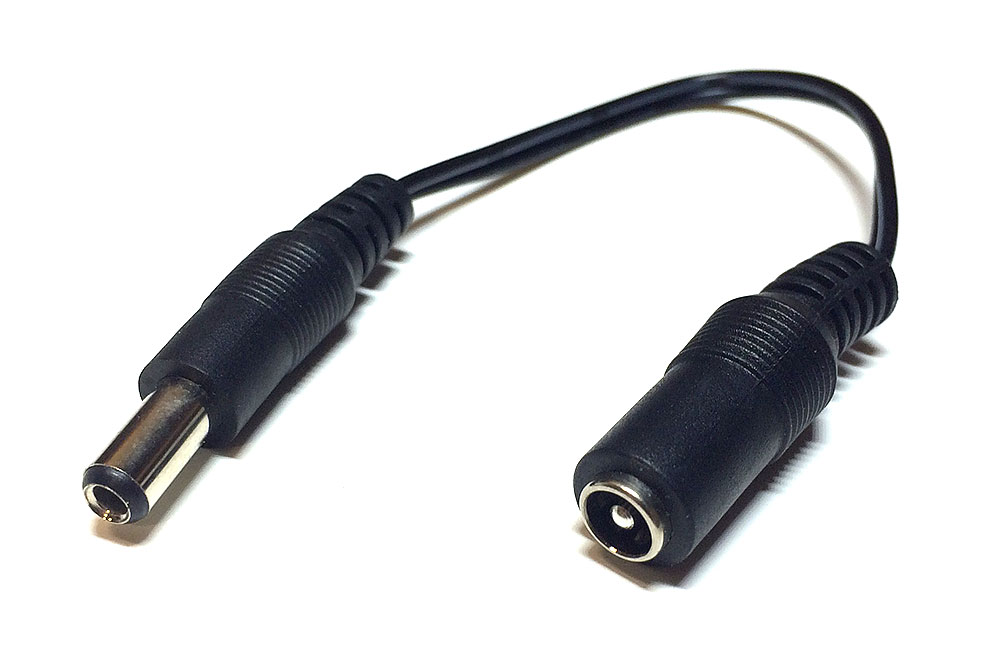

# Connectors

We want to ensure modularity, and we take our camp to countries with different national standards.

We've settled on the following:

## AC

### IEC-309

Used for 110-240VAC, where water ingress is a concern. 

IEC-309 does not define a single plug - the full gamut can be viewed <a href="http://www.iec60309.com/">here</a>. We use the blue three-pin variant. This form factor is used on building sites. Ours are IP44, which means they are splashproof but can't be left in puddles.

These are tough but bulky. We use these between the generator and any junction boxes.

Rated at 16A.

### IEC-C13

Also know as a "kettle lead". Used for 110-240VAC where we can keep the connectors dry. (Technically, the male is C13 and the female is C14.)

These are small and convenient, and patch leads and Y-splitters are widely available.

Rated at 13A.

## DC

### Automotive connector

We don't have a part code for this, as there is very little standardisation in the automotive electrical industry. That's not very satisfactory. The parts we have are sold by <a href="http://www.ebay.co.uk/itm/2-Way-Waterproof-Weather-Proof-Sealed-Electrical-Connector-KIT-12V-24V-DC-/180734625987?hash=item2a149f88c3">Autostar on eBay</a>.

Rated at 14A.

_We wouldn't push anything like this current over any part of our DC circuit. We over-rate to reduce transmission losses, which are significant at low voltage._

### 2.1/5.5 barrel jack

This is by far the most common connector for portable devices that take 12V. Commercially-available portable devices are usually wired them tip-positive, so we have made that our standard. (Tip, in this context, referring to the inside bit.) This has the happy effect of enabling us to plug in lots of commercial products directly.

Ratings vary, but we try to avoid exceeding 2A.

**Remember that the female end must be fitted to the power source side, and the male end must be fitted to the appliance side.** The male end is the connector with visible metal prongs; don't be fooled by the fact that the female end might be inserted into the housing of the male end.
